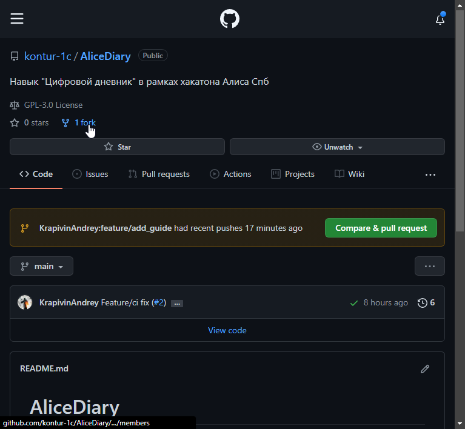
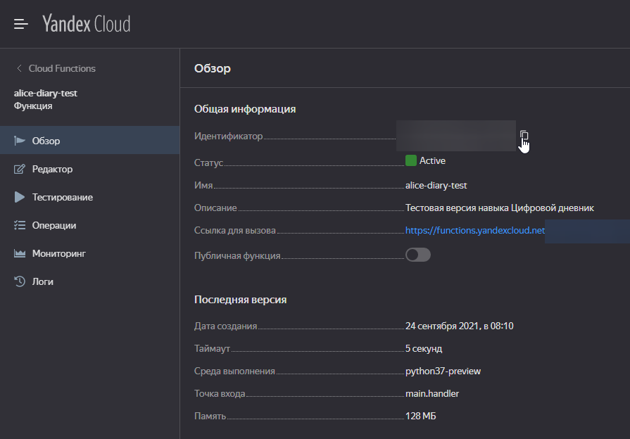
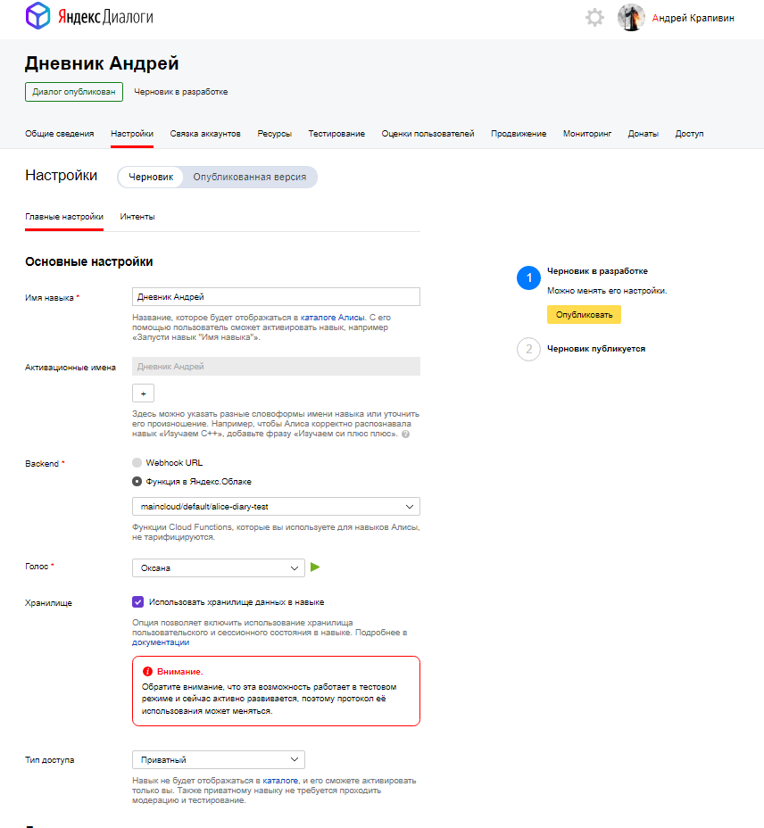
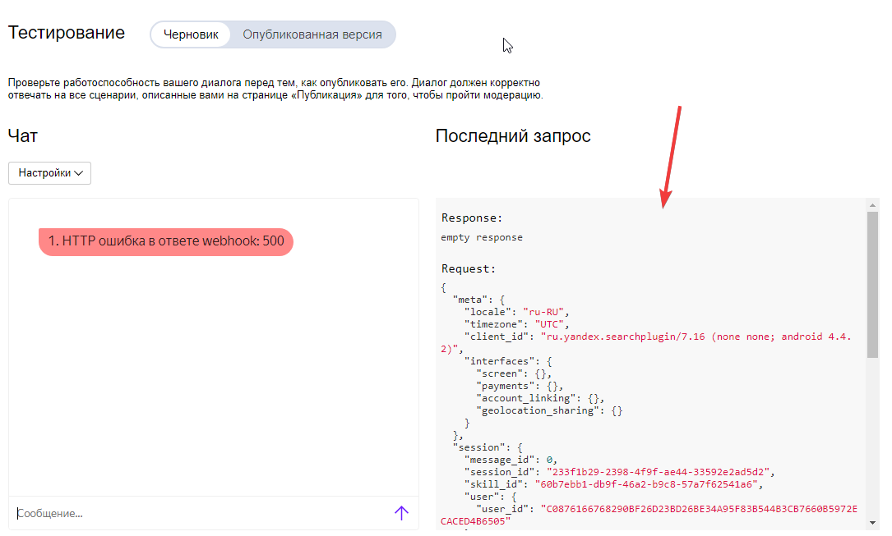
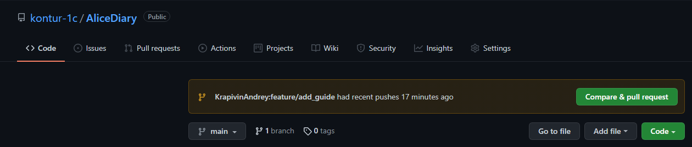

# Участие в проекте

## Подготовка репозитория

### 1. Сделать форк основного репозитория



### 2. Клонируете себе и настраиваете upstream

```bash

git clone https://github.com/<my>/AliceDiary
git remote add upstream https://github.com/kontur-1c/AliceDiary.git
git fetch upstream
git checkout -b main upstream/main
git pull upstream main
```

### 3. Создаем облачную функцию и свой навык

1. Регистрируемся в [ЯндексОблаке](https://console.cloud.yandex.ru/)
2. Создаем облачную функцию и копируем ее id

    

3. Создаем тестовый диалог в [ЯндексДиалогах](https://dialogs.yandex.ru/developer/skills)

+ Приватный
+ Хранение данных
+ Backend: ЯндексФункция



### 4. Настройка деплоя

Для автообновления Вашей функции необходимо заполнить секреты в репозитории.
Идем в Settings/secrets

+ Авторизация в облаке. Добавить секрет *YAAUTH* с этим [ключом](https://oauth.yandex.ru/authorize?response_type=token&client_id=1a6990aa636648e9b2ef855fa7bec2fb)
+ Ссылка на функцию. Добавить секрет *TEST_FUNCTION_ID* с идентификатором вашей функции

### 5. Ведем разработку

Для отладки используйте скрипт emulate.py. Он ждет в корне файл json - запрос в Алису.
Взять его можно во время тестирования навыка в консоли


Не забываем про тесты. Для тестирования используем pytest

### 6. Настройка линтеров

Для проверки корректности форматирования кода используем линтеры/форматеры black, flake8, isort
Вручную их можно запустить командами

+ black skills
+ flake8 skills
+ isort skills

Но лучше настроить интеграцию с IDE для автоформатирования при сохранении файла и подсветки ошибок.
Пример для [VS Code](../.vscode/settings-example.json)

### 7. Отправляем pull request



Ждем прогона тестов в GitHub Actions и когда пройдет ревью

### 8. Чуть позже здесь будет про интенты
